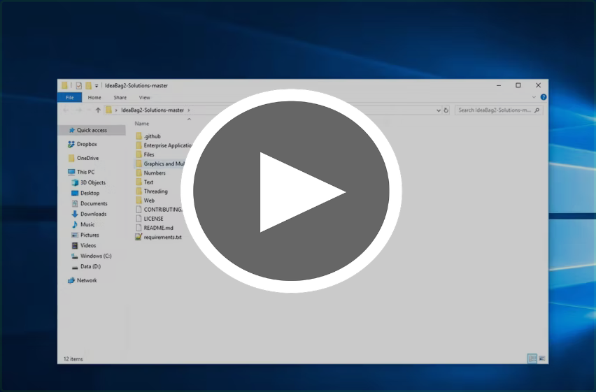

# IdeaBag2-Solutions
This is a collection of programs from the *Idea Bag 2* app ([*Programming Ideas 2*](https://play.google.com/store/apps/details?id=com.alansa.ideabag2) on the google play store).

The intention of this project is to help people that are stuck on an Idea or want to see another approach.
The goal is also to find optimal solutions for all Ideas.
The programs are made in a way that it is easy to understand and learn from them.

All programs are written in python 3.
The original categories from *Idea Bag 2* are used to organize them.

*Idea Bag 2* also has a github repository which can be found [here](https://github.com/mclintprojects/ideabag2).

## How to use
If you want to get the programs for playing around with them or editing them just download or clone them from Github.
All programs need [python 3.7](https://www.python.org/downloads/) or later installed, 
and for some of them external modules are required.
Go to [Dependencies](#dependencies) to check which modules you need to install and how.

You can watch this video, which explains how to use this repository and how it is organized:

## Contributing
If you want to contribute in any way please take a look at [CONTRIBUTING.md](CONTRIBUTING.md).

## Dependencies
* [Python 3.7+](https://www.python.org/downloads/)
* [Pillow](http://python-pillow.org) (Graphics and Multimedia/Dominant Colors, Threading/Bulk Thumbnail Creator)
* [Beautifulsoup](https://www.crummy.com/software/BeautifulSoup/) (Web/Page Scraper)
* [Pygame](https://www.pygame.org/) (Graphics and Multimedia/Mp3 Player)
* [SymPy](https://www.sympy.org/) (Numbers/Find Pi to the Nth digit)
* [ntplib](https://code.google.com/archive/p/ntplib/) (Networking/Get Atomic Time form Internet Clock)

You can install all of them together through running `pip install -r requirements.txt` inside the repository folder.

If you only want to install some of them you can find the required versions in [requirements.txt](requirements.txt).

## License
This repository uses the MIT License.
A copy of it can be found in [LICENSE](LICENSE).
